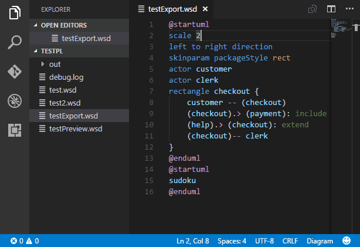

# Plantuml Setup & Markup Rendering
Show how to setup Plantuml in VSCode and publish diagrams in Github

- Install VSCode
- [Install Plantuml plugin](https://marketplace.visualstudio.com/items?itemName=jebbs.plantuml)

Note: I recommend to use a local install for larger diagrams, see https://github.com/qjebbs/vscode-plantuml#requirements-for-local-render for details on installing and config of the plugin


## Markup Rendering

There are two methods of rendering, static or dynamic. Dynamic is useful for every changing diagrams, but does place a great burnden on the wiki (make the external call out) and the plantuml.com servers. If your diagrams don't change, or are managed in the same location as the plantuml file, I would highly recommend using the static method, so to be a good citizen of the fantastic service from plantuml.com

### Static Rendering
Static rendering is the porcess of producing a static PNG or SVG and storing alongside the PUML source file. This is easily achievd with the VSCode Plantuml plugin as follows: -



The result is the same, but remains static and can be then used externally in other systems. See https://github.com/hoggmania/plantuml-setup/blob/master/test.png 


### Dynamic Rendering
Dynamic rendering requires a call to the online plant server, there are a few methods available: -
- Render inline encode plantuml stream (png/svg) to endpoint ```http://www.plantuml.com/plantuml/png/{stream}```
- Render remote file ```http://www.plantuml.com/plantuml/proxy?idx=0&src={url encoded(raw github location})```


So if the raw github location of the puml file is https://raw.githubusercontent.com/hoggmania/plantuml-setup/master/test.puml the encode markup is: -
```

```

This example renders the following image:


## Using include files to change styles

If you look at the file https://raw.githubusercontent.com/hoggmania/plantuml-setup/master/test.puml you will see it has pre-processing files that it includes, for macros and styling.

Example includes:
```
@startuml
!define PUML https://raw.githubusercontent.com/hoggmania/plantuml-stdlib/master
!include PUML/puml-themes.iuml /' Contains styling '/
!include PUML/puml-methods.iuml /' Contains sequence diagram macros '/
.
.
.

```

These includes can be added to, or overriden locally within the file such as: -

```
/'Local Styling additions or overrides'/
skinparam node {
    backgroundColor<<Client>> LightSlateGrey
}
skinparam component {
    backgroundColor<<Client>> Coral
}
```

These stereo types ```<<Client>>``` can then be tagged onto a node/component: -

```
    Node Applications <<Runtime>> {
        component Backend <<Client>>
        component UserAdmin <<Client>> {
            UserAdmin .> RuntimeStaffRealms: provision\n<<SCIM>>
        }
        RuntimeStaffRealms --> Applications: SSO manage
    }
```


